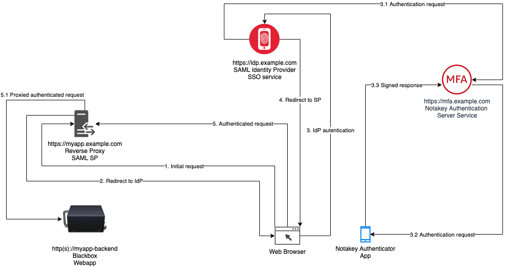

# Add Multi Factor Authentication To Your Legacy Web Application

Configuration example of adding Notakey Multi Factor authentication to a legacy web application.

## Required prior knowlegde

- Apache

- Docker

- Basic understanding how SAML (Security Assertion Markup Language) works ( implies PKI - Public Key Cryptography )

## Prerequisites

- Working Notakey Authentication Appliance (NtkAA), get it [here](https://www.notakey.com/downloads/).

- Working Notakey Authentication Service (NtkAS) service, more info [here](https://documentation.notakey.com/naa/#authentication-server).

- Working Single Sign On (SSO) service that comes with NtkAA, more info [here](https://documentation.notakey.com/naa/#single-sign-on-server).

## Assumptions

- You have a web application that has no authentication or has its own implementation (a blackbox)
that you would like to add second factor on top without changing any application code.

- Your blackbox application can be isolated from direct access on infrastructure level (e.g. with firewall) or it can be deployed as a container in docker infrastructure where it can be isolated by deploying in dedicated network (not covered here).

- All required HTTP SSL certificates and DNS configuration is in place.

## General workflow

Here is a diagram of authentication process (simplified for clarity).



### Description of steps:

1. Web browser requests protected URL of your blackbox webapp from reverse proxy.

2. Reverse proxy redirects browser to identity provider (IdP).

3. IdP follows configured security requirements and requests user to authenticate.

  * 3.1. After entering username, an authentication request is sent to user in NtkAS.

  * 3.2. NtkAS sends this request to users mobile app.

  * 3.3. If user approves the request, response is signed and sent back to NtkAS, that in turn responds to SSO service.

4. If authentication is validated successfully, users browser is redirected back to reverse proxy together with signed SAML assertion.

5. Browser sends request again for protected resource including SAML assertion from IdP. Reverse proxy verifies signature against certificate in configured IdP metadata.

  * 5.1. If signature is valid reverse proxy passes the request through to backend blackbox webapp.


## Configuration steps

### 1. Generate metadata and certificates for authentication request signing

  - Generate SAML SP certificates with `mellon_create_metadata.sh`

```shell
$ mkdir ./mellon-config
$ docker run -it -w="/mellon" \
             -v ${PWD}/mellon-config:/mellon:rw \
             --rm soarinferret/mod_auth_mellon:debian \
             sh -c "mellon_create_metadata.sh https://myapp.example.com https://myapp.example.com"

Output files:
Private key:               https_myapp.example.com.key
Certificate:               https_myapp.example.com.cert
Metadata:                  https_myapp.example.com.xml

Host:                      myapp.example.com

Endpoints:
SingleLogoutService:       https://myapp.example.com/logout
AssertionConsumerService:  https://myapp.example.com/postResponse


$ ls -al mellon-config/
# Directory will contain all certificate, key and metadata.
```

### 2. Retrieve SAML Identity Provider metadata

- If you have deployed SSO service on FQDN idp.example.com, your metadata URL will be https://idp.example.com/sso/saml2/idp/metadata. If you have metadata authentication enabled, you will need to access this link via federation page (https://idp.example.com/sso/module/core/frontpage_federation).

```shell
$ wget https://idp.example.com/sso/saml2/idp/metadata -O mellon-config/metadata.xml
```

### 3. Write configuration for Apache web server

- Download sample configuration from [here](https://raw.githubusercontent.com/notakey-examples/blackbox-webapp-2fa-howto/master/config/saml-standalone.conf)

-  Configure SP server name (SP FQDN)

```
ServerName myapp.example.com
```

-  Configure your backend (URL to blackbox you will be protecting)

```
    ProxyPass /saml/ !
    ProxyPass / http://myapp-backend/
    ProxyPassReverse / http://myapp-backend/
```

- Adjust the MellonUser config. This is the main user identifier, if using basic SSO configuration this will be uid.

```
MellonUser "uid"
```

- Adjust the Entity ID of your SP. This value will be used by IdP to identify your service.

```
MellonSPentityId "https://myapp.example.com"
```

- Adjust certificate file names generated in step 1.

```
    # Update these with your own certificates from step 1
    MellonSPPrivateKeyFile /mellon/https_myapp.example.com.key
    MellonSPCertFile /mellon/https_myapp.example.com.cert

    # Provide metadata from step 2
    MellonIdPMetadataFile /mellon/metadata.xml
```

- Adjust the HTTP SSL termination part

```
    # SSL Config - update SSL with your own cert files
    SSLEngine On
    # Remember copy your certificate files in volume passed to docker container
    SSLCertificateFile /mellon/my_ssl.crt
    SSLCertificateKeyFile /mellon/my_ssl.key
    SSLCertificateChainFile /mellon/my_ssl.ca.crt
```

### 4. Start SP reverse proxy service

- Start apache mellon container

```shell
$ docker run -d \
    --name myapp-proxy \
    -v ${PWD}/saml-standalone.conf:/usr/local/apache2/conf/httpd.conf:ro \
    -v ${PWD}/mellon-config:/mellon:ro \
    --restart unless-stopped \
    -p 80:80 \
    -p 443:443 \
    soarinferret/mod_auth_mellon:debian
```

- Check logs for any configuration errors with `docker logs myapp-proxy`

### 5. Register your Service Provider (SP) with Identity Provider

- Fetch SP metadata from reverse proxy service metadata URL. If using default configuration, URL to metadata will be https://myapp.example.com/saml/metadata.

```shell
$ wget https://myapp.example.com/saml/metadata -O sp-metadata.xml
```

- Open federation page on your SSO service (https://idp.example.com/sso/module/core/frontpage_federation)

- Click on "XML metadata to JSON converter"

- Upload file "sp-metadata.xml"

- Converted metadata part will contain configuration entry value you will need to register your new SP

```
{
    "entityid": "https://myapp.example.com",
    "contacts": [],
    "metadata-set": "saml20-sp-remote",
    "AssertionConsumerService": [
        {
            "Binding": "urn:oasis:names:tc:SAML:2.0:bindings:HTTP-POST",
            "Location": "https://myapp.example.com/saml/postResponse",
            "index": 0
        }
    ],
    "SingleLogoutService": [
        {
            "Binding": "urn:oasis:names:tc:SAML:2.0:bindings:HTTP-Redirect",
            "Location": "https://myapp.example.com/saml/logout"
        }
    ],
    "keys": [
        {
            "encryption": false,
            "signing": true,
            "type": "X509Certificate",
            "X509Certificate": "MII...PbRM="
        }
    ]
}
```

- Take this output and convert to appliance command. All service providers are located under `:sso.\"saml-sp\"` configuration path. Entity ID is the identifier for the IdP to identify your SP. The entity ID of service must match the key under which the SP is defined, so the full configuration path is `:sso.\"saml-sp\".\"https://myapp.example.com\"`

```shell
$ ntk cfg set :sso.\"saml-sp\".\"https://myapp.example.com\" '{
    "entityid": "https://myapp.example.com",
    "contacts": [],
    "metadata-set": "saml20-sp-remote",
    "AssertionConsumerService": [
        {
            "Binding": "urn:oasis:names:tc:SAML:2.0:bindings:HTTP-POST",
            "Location": "https://myapp.example.com/saml/postResponse",
            "index": 0
        }
    ],
    "SingleLogoutService": [
        {
            "Binding": "urn:oasis:names:tc:SAML:2.0:bindings:HTTP-Redirect",
            "Location": "https://myapp.example.com/saml/logout"
        }
    ],
    "keys": [
        {
            "encryption": false,
            "signing": true,
            "type": "X509Certificate",
            "X509Certificate": "MII...PbRM="
        }
    ]
}' --json-input

```

- Remember to restart SSO service to apply configration with `ntk sso restart`

- Navigate to https://myapp.example.com and verify that you are being redirected to IdP and authentication works.


### 6. (Optional) Running SP reverse proxy on Notakey Appliance

It is posssible to run custom services on Notakey appliance reusing existing HTTP SSL wildcard certificates or ACME configuration. If your blackbox app ir reachable directly from Notakey Appliance, you can deploy authentication reverse proxy directly on appliance nodes.

- Configure additional FQDN (if using ACME certificates)

```shell
$ ntk cfg setc :rp.extra_domains "myapp.example.com"
```

- Adjust configuration in saml-appliance.conf, found [here](https://raw.githubusercontent.com/notakey-examples/blackbox-webapp-2fa-howto/master/config/saml-appliance.conf)


- Copy saml-appliance.conf and certificate files (https_myapp.example.com.cert, https_myapp.example.com.key) to appliance. If you have more than one node you will have to copy to all nodes, that will be serving this service, or copy files to ~/userlogos and use `ntk sso sync` command to synchronise the contents on all nodes.

```shell
$ scp ./config/* ntkadmin@ntk-node:/home/ntkadmin/userlogos/
```

- Start container. This will expose container port 9000 internally via builtin reverse proxy service.

```shell
$ docker run -d \
    --name myapp-proxy \
    --label traefik.frontend.entryPoints=https \
    --label traefik.frontend.rule="Host:myapp.example.com" \
    --label traefik.enable=true \
    --label traefik.port=9000 \
    -v /home/ntkadmin/userlogos/saml-appliance.conf:/usr/local/apache2/conf/httpd.conf:ro \
    -v /home/ntkadmin/userlogos:/mellon:ro \
    --restart unless-stopped \
    --net traefik-net \
    soarinferret/mod_auth_mellon:debian
```

## Resources

- [soarinferret/mod_auth_mellon](https://hub.docker.com/r/soarinferret/mod_auth_mellon)

- [docker-mod_auth_mellon on Github](https://github.com/SoarinFerret/docker-mod_auth_mellon)

- [Mellon module user guide](https://github.com/latchset/mod_auth_mellon/blob/master/doc/user_guide/mellon_user_guide.adoc)

## Final notes

As with any production service be sure to check out public vulnerability databases before deploying, as mod_auth_mellon has had several security vulnerabilities in the past.

Apache configuration files saml-standalone.conf and saml-appliance.conf are provided as mere examples and should be adjusted to your security and scaling requirements.